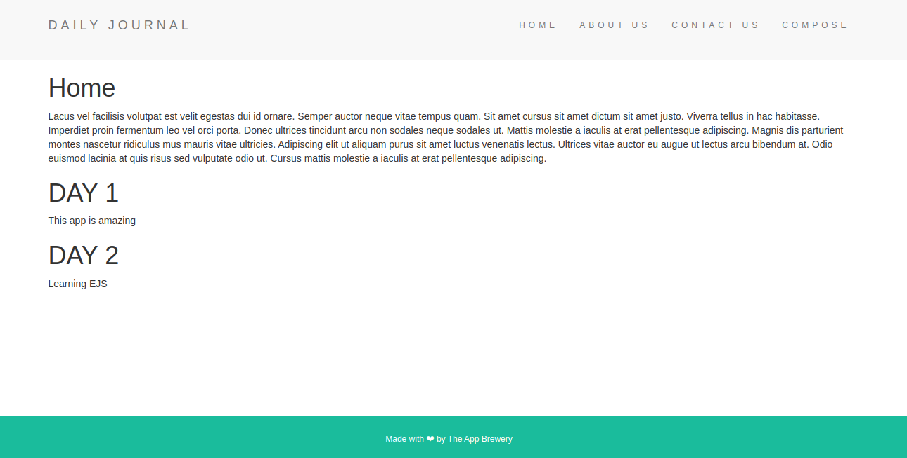

# Practice: Blog site with EJS

This project is part of the learning path of the course: **The complete web development bootcamp**.
In this project you will experience for the first time working with a JS framework (EJS) that significantly simplifies the work of creating a web application.

## View

## Technologies

    - HTML
    - CSS
    - Node
    - Express
    - EJS
