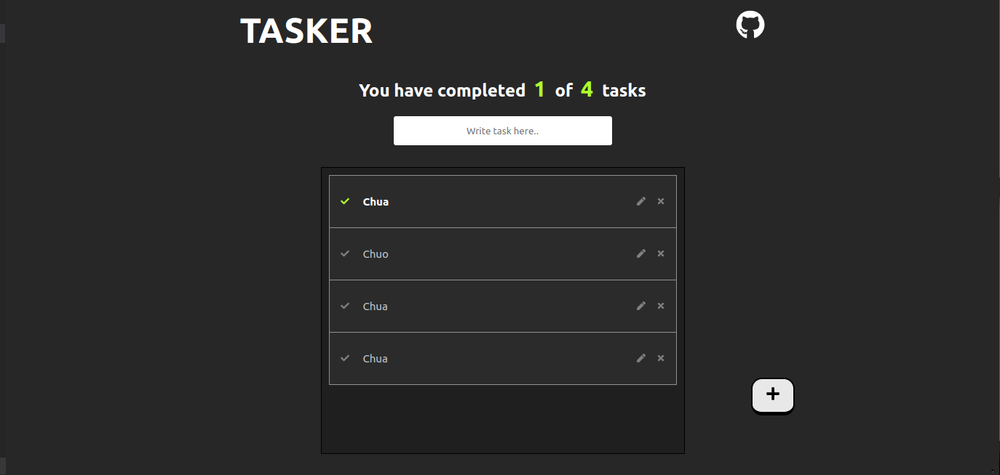

# Practice: Todo List with React

This is my first project with React, which covers the most basic topics about this amazing JS framework.

## Actions

- Create tasks.
- Read the tasks that you have saved in **_local storage_**
- Update the name of any item.
- Delete tasks
- Synchronize tasks in several tabs.

### All completed

### Empty state

### Add a task

## Technologies

    - HTML
    - CSS
    - JS
    - React
    - Vite
